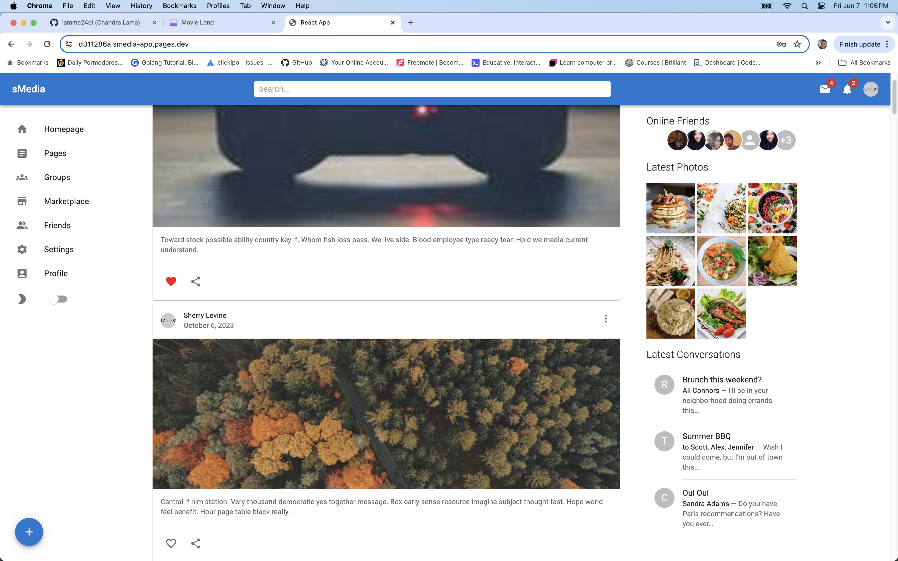
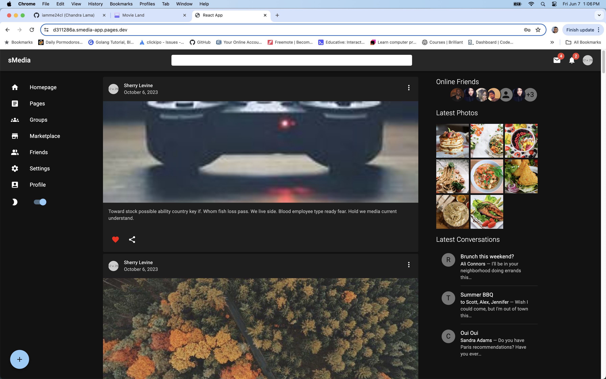
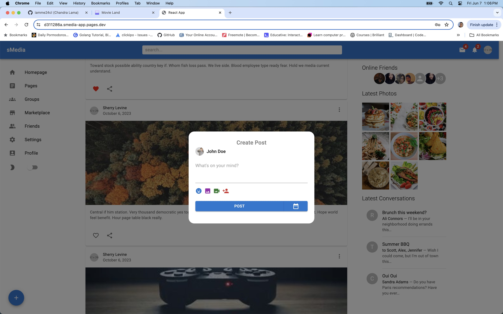
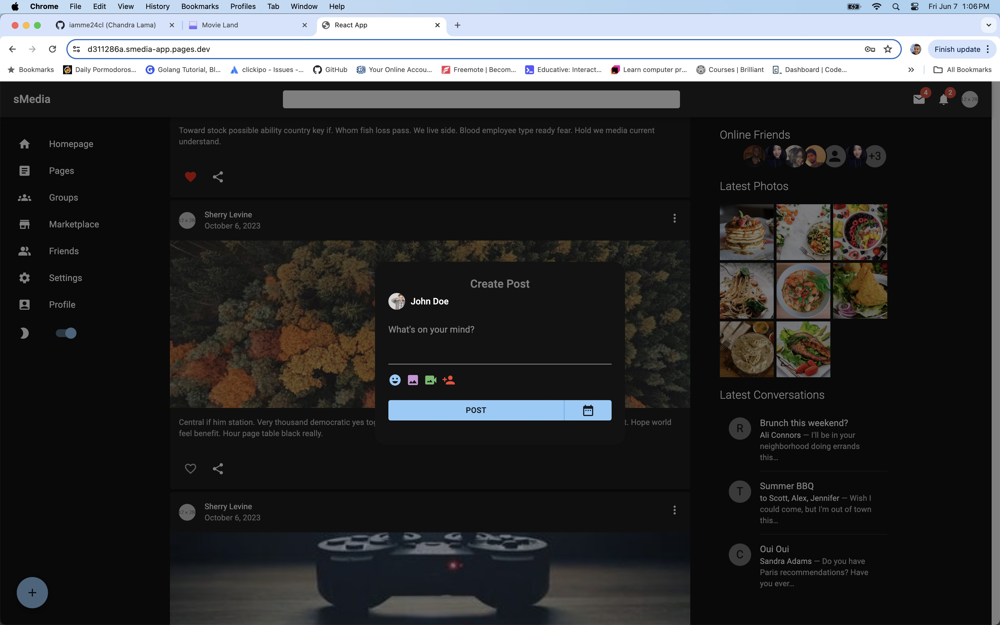

# Social Media App

## Overview
The Social Media App is a dynamic platform enabling users to create profiles, post updates, and interact with others. A key feature of the app is the ability for users to send messages to each other in real time, made possible by Socket.io integration.

## Features
- User profile creation and management
- Post updates and interact with other users' posts
- Real-time messaging between users
- Responsive user interface

## Technologies Used
### Backend
- **Python**: Used as the primary programming language for backend development.
- **Flask**: A lightweight WSGI web application framework.
- **Socket.io**: Enables real-time, bidirectional communication between web clients and servers.

### Frontend
- **React**: A JavaScript library for building user interfaces.
- **Material UI**: A popular React UI framework for building aesthetically pleasing and responsive user interfaces.
- **Socket.io**: Used for real-time communication on the client side.

## Application Images

*Caption: Homepage displaying sidebar, feed with posts fro various users with options to like, comment, and share.*


*Caption: Homepage displaying sidebar, feed with posts fro various users with options to like, comment, and share.*


*Caption: Post something*


*Caption: Post something*

## Installation

1. **Clone the repository:**
   ```bash
   git clone https://github.com/yourusername/social-media-app.git
   cd social-media-app
   ```

2. **Backend Setup:**
   ```bash
   cd backend
   source venv/bin/activate  # On Windows use `env\Scripts\activate`
   pip install -r requirements.txt
   python3 app.py
   ```

3. **Frontend Setup:**
   ```bash
   cd frontend
   npm install
   npm start
   ```
